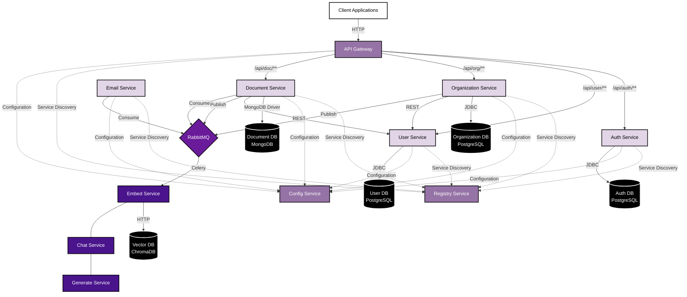

# Play-Book Microservices Architecture

This diagram shows the microservices architecture of the Play-Book application, including the communication methods between services and the databases they use.

## Communication Methods

1. **REST API**:
   - API Gateway routes external requests to microservices
   - Service-to-service synchronous communication (e.g., Document Service calling User Service)

2. **RabbitMQ Messaging**:
   - Asynchronous communication between services
   - Event-driven architecture (e.g., Space deletion triggering document deletion)
   - Integration with Python services via Celery

3. **Service Discovery**:
   - Services register with Registry Service
   - Enables dynamic service location

4. **Configuration**:
   - Centralized configuration via Config Service

## Databases

1. **PostgreSQL**:
   - Auth Service: User authentication and authorization data
   - User Service: User profiles and related data
   - Organization Service: Organizations, teams, and spaces data

2. **MongoDB**:
   - Document Service: Document storage and metadata

3. **ChromaDB**:
   - Vector database for document embeddings used by the Chat Service

## Data Flow Examples

1. **Document Creation**:
   - Client creates document via API Gateway
   - Document Service stores document in MongoDB
   - Document Service publishes message to RabbitMQ
   - Embed Service consumes message and creates vector embeddings in ChromaDB

2. **Space Deletion**:
   - Client deletes space via API Gateway
   - Organization Service processes deletion
   - Organization Service publishes DOCUMENT_DELETE message to RabbitMQ
   - Document Service consumes message and deletes associated documents